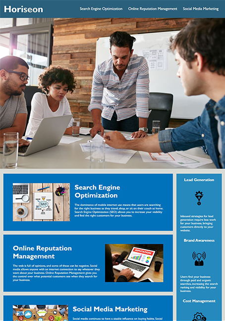

# Horiseon Website - Refactoring & Accessibility
###### end result here: https://radergan.github.io/accessibility-refactor-horiseon/

## Summary 
A refactor of the HTML/CSS for Horiseon Social Solution Services, Inc, a marketing company, was requested; the objective was to increase the website's accessibility. Efforts were made to accomplish the following:
- Add semantic structure instead to aid in accessibility
- Add missing/sparse information that is important to accessibility, incl. alt tags and meaningful title information
- Consolidate and organize style information, including bloated CSS redundancy
- Identify and resolve issues with page load speed

### User Story: Horiseon
> As a marketing agency, we want a codebase that follows accessibility standards 
> so that our own site is optimized for search engines.

### Acceptance Criteria
Accessibility standards will be met when:
- Semantic HTML elements will be incorporated into the source code
- The structure of the HTML elements flow logically, independent of style or position of elements
- All image elements have a corresponding alt property
- Heading attributes fall in sequential order
- The title element is concise and descriptive

## Fulfillment of Criteria

**A small screenshot of the final product is shown to the right**. 

The work was spread across three types of effort, to meet the acceptance criteria:

- Refactoring the body structure using semantics
- Alteration/consolidation of CSS to match structural changes
- Diagnosing and fixing performance issues

### Semantic / Structure Changes
- Changed the class="header" div to a header block
- Changed the div within the header block to a nav block
- Changed all references to .header div selector to .header nav within the style.css file
- Fixed an anchor that pointed to a div ID that didn't exist, causing broken functionality
- The side-panel in the main body content was changed from div to the semantic 'aside'
- Wrapped the body's main content in a main block to designate the main content block
- Added clarifying comments to the main's root page
- Standardized spacing and indentation amongst page elements

### CSS Cleanup / Consolidation
- Lines of CSS reduced by ~40% (down to 120, from 200)
- Number of class selectors reduced (consolidated to 17, down from 32)
- Improved the logical flow and grouping of related styles

### Performance Improvements
The size of the images being pulled in to the primary-content-section as well as the hero-image section were not conducive to loading the page in a reasonable amount of
time. Compressing these images improved the page load time significantly.

### Utilized References
 - Web Accessibility - Mozilla  | https://developer.mozilla.org/en-US/docs/Web/Accessibility
 - WBC Accessibility Principles | https://www.w3.org/WAI/fundamentals/accessibility-principles/
